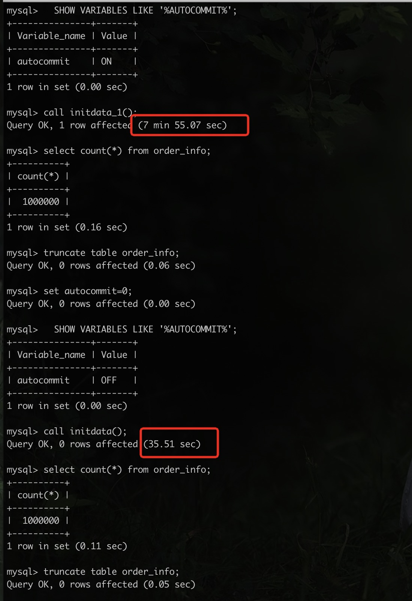

### 第七周作业

## 作业一
>按自己设计的表结构，插入 100 万订单模拟数据，测试不同方式的插入效率

**为了保证测试的准确性，尽量排除一些干扰因素，order_info表除主键外没有其他索引，每种测试开始前都会将数据清除**

本次采用了三种方式进行测试，分别是：
1. 使用存储过程（initData）一条一条插入，一个事务
2. 使用存储过程（initData_1）一条一条插入，一条一个事务
3. 将1或2的结果使用 mysqldump 导出后，再使用source导入
```
mysqldump -hlocalhost -P3306 -uroot --add-locks=0 --no-create-info --single-transaction --set-grid-purged=OFF shopping --result-file=/Users/wuweihua/Desktop/order.sql
```
```
source /Users/wuweihua/Desktop/order.sql;
```
测试结果速度从快到慢依次为：3>1>2
- 方法1花费时间约为 35.51s
- 方法2花费时间为 7min 55.07s  最慢
- 方法3花费时间约22s 最快




以下是存储过程的创建
```sql
DROP PROCEDURE if exists initData;
DELIMITER $
CREATE PROCEDURE initData()
BEGIN
    DECLARE i INT DEFAULT 1;
    DECLARE now TIMESTAMP DEFAULT now();
    SET AUTOCOMMIT = 0;
    START TRANSACTION;
    WHILE i <= 1000000
        DO
            insert into order_info (id, order_no, user_info_id, booking_time, pay_time, shipping_time, receive_time,
                                    order_status, order_amount, discount_amount, shipping_amount, payment_amount,
                                    shipping_user, province, city, district, address, payment_method, invoice_title,
                                    order_point, shipping_comp_name, shipping_no, gmt_create, gmt_modify)
            values (i, '8888888888', i, now, now, now, now, 0, 100, 0, 0, 100, 'Tom', 1, 1, 1, 'abc', 1, 'Tom', 100,
                    'SF', '12345678', now, now);
            SET i = i + 1;
        END WHILE;
    COMMIT;
END $


DROP PROCEDURE IF EXISTS initData_1;
DELIMITER $
CREATE PROCEDURE initData_1()
BEGIN
    DECLARE i INT DEFAULT 1;
    DECLARE now TIMESTAMP DEFAULT now();
    WHILE i <= 1000000
        DO
            insert into order_info (id, order_no, user_info_id, booking_time, pay_time, shipping_time, receive_time,
                                    order_status, order_amount, discount_amount, shipping_amount, payment_amount,
                                    shipping_user, province, city, district, address, payment_method, invoice_title,
                                    order_point, shipping_comp_name, shipping_no, gmt_create, gmt_modify)
            values (i, '8888888888', i, now, now, now, now, 0, 100, 0, 0, 100, 'Tom', 1, 1, 1, 'abc', 1, 'Tom', 100,
                    'SF', '12345678', now, now);
            SET i = i + 1;
        END WHILE;
END $
```

